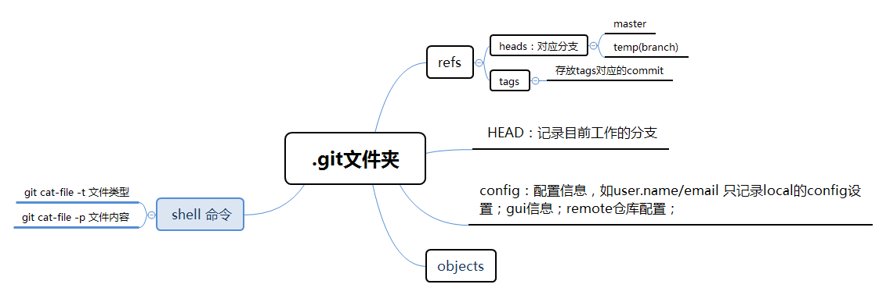
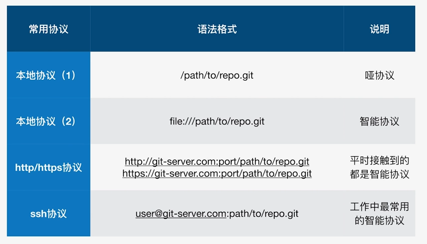

* [git几个知识点](#git%E5%87%A0%E4%B8%AA%E7%9F%A5%E8%AF%86%E7%82%B9)
* [git 配置](#git-%E9%85%8D%E7%BD%AE)
* [\.git folder](#git-folder)
* [git HEAD](#git-head)
  * [1 git HEAD](#1-git-head)
  * [2 恢复暂存区为HEAD状态](#2-%E6%81%A2%E5%A4%8D%E6%9A%82%E5%AD%98%E5%8C%BA%E4%B8%BAhead%E7%8A%B6%E6%80%81)
  * [3 恢复工作区为暂存区状态](#3-%E6%81%A2%E5%A4%8D%E5%B7%A5%E4%BD%9C%E5%8C%BA%E4%B8%BA%E6%9A%82%E5%AD%98%E5%8C%BA%E7%8
A%B6%E6%80%81)
  * [4 清空工作区](#4-%E6%B8%85%E7%A9%BA%E5%B7%A5%E4%BD%9C%E5%8C%BA)
* [git commit](#git-commit)
  * [1 提交](#1-%E6%8F%90%E4%BA%A4)
  * [2 修改上次/某次commit的message](#2-%E4%BF%AE%E6%94%B9%E4%B8%8A%E6%AC%A1%E6%9F%90%E6%AC%A1commit%E7%9A%84message)
  * [3 合并连续的几次commmit](#3-%E5%90%88%E5%B9%B6%E8%BF%9E%E7%BB%AD%E7%9A%84%E5%87%A0%E6%AC%A1commmit)
  * [4 合并不连续的几次commit](#4-%E5%90%88%E5%B9%B6%E4%B8%8D%E8%BF%9E%E7%BB%AD%E7%9A%84%E5%87%A0%E6%AC%A1commit)
  * [5 消除最近几次commit](#5-%E6%B6%88%E9%99%A4%E6%9C%80%E8%BF%91%E5%87%A0%E6%AC%A1commit)
* [git log](#git-log)
* [git diff](#git-diff)
  * [1 查看暂存区和HEAD的差异](#1-%E6%9F%A5%E7%9C%8B%E6%9A%82%E5%AD%98%E5%8C%BA%E5%92%8Chead%E7%9A%84%E5%B7%AE%E5%BC%82)

  * [2 查看暂存区和工作区的差异](#2-%E6%9F%A5%E7%9C%8B%E6%9A%82%E5%AD%98%E5%8C%BA%E5%92%8C%E5%B7%A5%E4%BD%9C%E5%8C%BA%E7
%9A%84%E5%B7%AE%E5%BC%82)
  * [3 查看两个分支/commit之间的差异](#3-%E6%9F%A5%E7%9C%8B%E4%B8%A4%E4%B8%AA%E5%88%86%E6%94%AFcommit%E4%B9%8B%E9%97%B4%
E7%9A%84%E5%B7%AE%E5%BC%82)
* [git stash](#git-stash)
* [git branch](#git-branch)
* [\.gitignore file](#gitignore-file)
* [GUI Git](#gui-git)
* [git仓库备份](#git%E4%BB%93%E5%BA%93%E5%A4%87%E4%BB%BD)
  * [1 常用传输协议](#1-%E5%B8%B8%E7%94%A8%E4%BC%A0%E8%BE%93%E5%8D%8F%E8%AE%AE)
* [git remote](#git-remote)
* [git branch](#git-branch-1)

## git几个知识点

变更工作区------git checkout   
变更暂存区------git reset

```shell
git mv readme readme.rd  #git重命名文件
git rm 'file'			 #git 删除file
```

## git 配置

```shell
git config --global/local/system user.name/email   

--global  				 #对所有仓库有效   
--local   				 #仅对当前仓库有效  
--system  				 #对所有登录用户有效
```

## .git folder
下图为.git文件夹中比较重要的文件夹和文件的结构和意义：


## git HEAD
### 1 git HEAD
HEAD指针可以指向一个分支，也可以指向commit，指向commit时为分离头指针状态；
几个和HEAD相关的git命令：

```shell
git diff HEAD HEAD^  (HEAD^^)
or
git diff HEAD HEAD~1  (HEAD~2)
```
HEAD^为HEAD的上一次commit

### 2 恢复暂存区为HEAD状态
需求场景：再将文件add到暂存区之后不想提交暂存区的内容

```shell
git reset HEAD						#这个操作之后，暂存区的所有变更会去除
git reset HEAD -- 'file1' 'file2'	#file1 2为add到暂存区的文件
```

### 3 恢复工作区为暂存区状态
需求场景：add文件到暂存区之后，工作区继续开发，发现工作区的变更不如暂存区，需要恢复暂存区的某些文件到工作区

```shell
git checkout -- 'file'				#file为add到暂存区的文件
```
### 4 清空工作区

```shell
git checkout .
```


## git commit
### 1 提交
```shell
git commit -m 'message'				#提交修改
```
### 2 修改上次/某次commit的message 
```shell
git commit --amend					#修改最近一次提交的message
git rebase -i 'commit_id'			#修改某次commit的message，commit_id应该为需要修改的commit的上一级commit，之后会进入选择操作，改第一行为 reword/r,保存退出，然后会自动进入修改message的界面，修改message，保存退出即可
```
### 3 合并连续的几次commmit
```shell
git rebase -i 'commit_id'	
#commit_id为需要合并的几次commit中最靠前的commit的上一个，进入选择操作交互，第一个选pick，最后一个也是pick，中间几次需要合并的选择 squash/s，然后保存退出，然后会跳转到合并提交commit的页面，添加合并log即可
```
### 4 合并不连续的几次commit
```shell
git rebase -i 'commit_id'	
#commit_id为需要合并的几次commit中最靠前的commit的上一个，进入选择操作交互后，第一个选pick，将需要合并的commit copy到将要合并到的commit的下面，改变状态为squash/s，并删除刚刚复制的原commi记录，保存退出后会跳转到合并提交commit的页面，添加合并log即可。
```
>
>注：   
>
>1. 若需要合并到的commit已经为根commit，则选择该commit作为rebase -i的commit_id，进入state修改界面之后,先将最老的commmit拷到顶部，然后同上述操作...   
>2. 多个commit合并只能将新的commmit合并到老的commmit。
### 5 消除最近几次commit

```shell
git reset --hard 'commmit_id'	
#这个命令会将工作区和暂存区回退到commit_id这个状态，会消除这个commit之后的记录！！！
```

## git log

最简单的看log的命令：git log   

后面可带的参数

```shell
--one line						#简介显示log，不包含修改者信息
--all							#查看所有分支的log	
--n4							#显示最近的4条记录
--graph							#以tree的方式查看commit的变化（多分支时好用）
```
以上几个参数可以同时使用！！

## git diff
### 1 查看暂存区和HEAD的差异
```shell
git diff add 'file'
git diff --cached
```
### 2 查看暂存区和工作区的差异
```shell
git diff add 'file'
git diff 
```
>
注：git add之后，再修改工作区，则git diff命令查看的是工作区和暂存区的差异。
>

### 3 查看两个分支/commit之间的差异

```shell
git diff 'branch1' 'branch2' 			#查看两个分支最新commit间的差异，会列出所有文件的差异
git diff 'branch1' 'branch2' -- 'file'	#查看两个分支file文件的差异
git diff 'branch1_commit' 'branch2_commit' -- 'file'	#查看两个/同一个分支的commit间的差异
```

## git stash
场景：开发过程中，工作区有修改，临时有新任务需要处理，需要将工作区的改动保存，等任务处理完之后在进行先前的开发工作

```shell
git stash						#将工作区和暂存区的改动先保存起来，清空工作区
git stash list					#查看保存堆栈的信息
git stash apply	（stash_id）	   #将保存在stash堆栈的改动返回到工作区，stash中的保存记录还在,多条stash记录的话需要加id
git stash pop					#将保存在stash堆栈最顶层的改动返回到工作区,stash中的保存记录删除
git stash drop stash@{0}		#删除stash第一个记录
git stash clear					#清空stash所有记录
```

## git branch

```shell
git branch -va					#查看所有分支
git checkout 'branch_name'		#切换分支
git checkout -b 'branch_name'   #新建本地分支
git branch -d/-D 'branch_name' 	#删除本地分支，-d报错，-D强制删除
```
## .gitignore file

```shell
*.idea							#.idea后缀的文件和.idea文件夹及下面的文件都不会被add
*.idea							#.idea文件夹下的文件都不会被add
```

## GUI Git

```shell
gitk
```

## git仓库备份

### 1 常用传输协议

>
哑协议传输进度不可见，智能协议进度可见；  
智能协议传输速度快；
>

```shell
git clone --bare 'path/.git' 'backup.git'	
#备份本地仓库，--bare不带工作区的clone，用于本地backup
```

```shell
git remote -v						#查看远端仓库
git remote add 'remote_repo_.git'	#添加远端仓库

sample：
git remote add 'name' /d/Work/Learning/AndroidLearning/backtest/zhineng.git	#使用哑协议添加远程仓库
git remote add 'name' file:///d/Work/Learning/AndroidLearning/backtest/zhineng.git	#使用智能协议添加远程仓库

#'d/Work/Learning/AndroidLearning/backtest/zhineng.git' 是备份的裸仓库， name为命名远端仓库名称

```
>
添加远端仓库，既可以是github这样的远端，也可以是本地backup的仓库作为远端
>

## git remote

## git branch

```shell
git branch -r 
git branch -d [name]  #d选项只能删除已经参与了合并的分支，对于未有合并的分支是无法删除的。如果想强制删除一个分支，可以使用-D选项
git push origin test:master    #提交本地test分支作为远程的master分支 //好像只写这一句，远程的github就会自动创建一个test分支
git push origin test:test      #提交本地test分支作为远程的test分支
```

