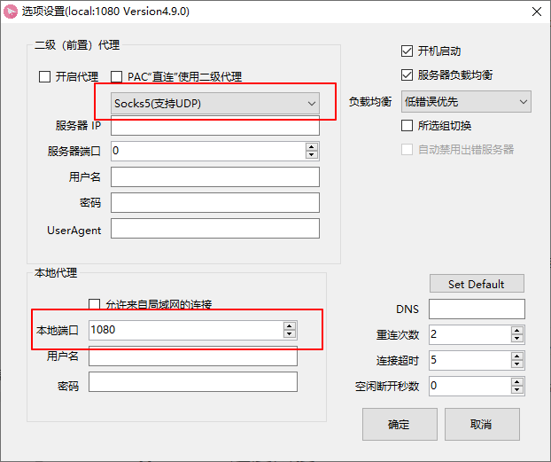

[TOC]

## git几个知识点

变更工作区------git checkout   
变更暂存区------git reset

```shell
git mv readme readme.rd  #git重命名文件
git rm 'file'			 #git 删除file
```

## git 配置

```shell
git config --global/local/system user.name/email   

--global  				 #对所有仓库有效   
--local   				 #仅对当前仓库有效  
--system  				 #对所有登录用户有效
```

## .git folder
下图为.git文件夹中比较重要的文件夹和文件的结构和意义：


## git HEAD
### 1 git HEAD
HEAD指针可以指向一个分支，也可以指向commit，指向commit时为分离头指针状态；
几个和HEAD相关的git命令：

```shell
git diff HEAD HEAD^  (HEAD^^)
or
git diff HEAD HEAD~1  (HEAD~2)
```
HEAD^为HEAD的上一次commit

### 2 恢复暂存区为HEAD状态
需求场景：再将文件add到暂存区之后不想提交暂存区的内容

```shell
git reset HEAD						#这个操作之后，暂存区的所有变更会去除
git reset HEAD -- 'file1' 'file2'	#file1 2为add到暂存区的文件
```

### 3 恢复工作区为暂存区状态
需求场景：add文件到暂存区之后，工作区继续开发，发现工作区的变更不如暂存区，需要恢复暂存区的某些文件到工作区

```shell
git checkout -- 'file'				#file为add到暂存区的文件
```
### 4 清空工作区

```shell
git checkout .
```


## git commit
### 1 提交
```shell
git commit -m 'message'				#提交修改
```
### 2 修改上次/某次commit的message 
```shell
git commit --amend					#修改最近一次提交的message
git rebase -i 'commit_id'			#修改某次commit的message，commit_id应该为需要修改的commit的上一级commit，之后会进入选择操作，改第一行为 reword/r,保存退出，然后会自动进入修改message的界面，修改message，保存退出即可
```
### 3 合并连续的几次commmit
```shell
git rebase -i 'commit_id'	
# commit_id为需要合并的几次commit中最靠前的commit的上一个，即将几次commit合并到commit_id上，-i 表示进入选择操作交互
# 之后第一个选pick，后面几次需要合并的选择 squash/s，即将这几次合并到第一次，然后保存退出，
# 之后会跳转到合并提交commit的页面，添加合并log即可
```
### 4 合并不连续的几次commit
```shell
git rebase -i 'commit_id'	
#commit_id为需要合并的几次commit中最靠前的commit的上一个进入选择操作交互后，第一个选pick，将需要合并的commit copy到将要合并到的commit的下面，改变状态为squash/s，并删除刚刚复制的原commi记录，保存退出后会跳转到合并提交commit的页面，添加合并log即可。
```
>
>注：   
>
>- 若需要合并到的commit已经为根commit，则选择该commit作为rebase -i的commit_id，进入state修改界面之后,先将最老的commmit拷到顶部，然后同上述操作...   
>- 多个commit合并只能将新的commmit合并到老的commmit。
### 5 消除最近几次commit

```shell
# 这个命令会将工作区和暂存区回退到commit_id这个状态，会消除这个commit之后的记录！！！
git reset --hard 'commmit_id'	
```

## git log

最简单的看log的命令：`git log`，后面可带的参数：

```shell
--one line						#简介显示log，不包含修改者信息
--all							#查看所有分支的log	
--n4							#显示最近的4条记录
--graph							#以tree的方式查看commit的变化（多分支时好用）
```
以上几个参数可以同时使用！！

## git diff
### 1 查看暂存区和HEAD的差异
```shell
git diff add 'file'
git diff --cached
```
### 2 查看暂存区和工作区的差异
```shell
git diff add 'file'
git diff 
```
>
注：git add之后，再修改工作区，则git diff命令查看的是工作区和暂存区的差异。
>

### 3 查看两个分支/commit之间的差异

```shell
git diff 'branch1' 'branch2' 			#查看两个分支最新commit间的差异，会列出所有文件的差异
git diff 'branch1' 'branch2' -- 'file'	#查看两个分支file文件的差异
git diff 'branch1_commit' 'branch2_commit' -- 'file'	#查看两个/同一个分支的commit间的差异
```

## git tag

tag相关操作，包括：

```shell
git tag								#查看tag
git tag -l "v0.1.*"					#可以查看v0.1.开头的tag，-l为通配符，或使用--list
git tag -a v1.0 -m "tag v1.0"		#打tag，-a添加附注标签，-m为tag添加信息
git show v1.0						#查看tag v1.0的信息和提交信息
git tag -a v1.0 commit_id(839b19)	#为过去的提交打tag
git push origin v1.0				#推送tag v1.0到远程
git push origin --tags				#一次性推送多条tag到远程
git tag -d v1.0						#删除本地tag v1.0
git push origin --delete v1.0		#删除远程标签
```

## git stash

场景：开发过程中，工作区有修改，临时有新任务需要处理，需要将工作区的改动保存，等任务处理完之后在进行先前的开发工作

```shell
git stash						#将工作区和暂存区的改动先保存起来，清空工作区
git stash list					#查看保存堆栈的信息
git stash apply	（stash_id）	   #将保存在stash堆栈的改动返回到工作区，stash中的保存记录还在,多条stash记录的话需要加id
git stash pop					#将保存在stash堆栈最顶层的改动返回到工作区,stash中的保存记录删除
git stash drop stash@{0}		#删除stash第一个记录
git stash clear					#清空stash所有记录
```

## git branch

```shell
git branch -va					#查看所有分支
git checkout 'branch_name'		#切换分支
git checkout -b 'branch_name'   #新建本地分支
git branch -d/-D 'branch_name' 	#删除本地分支，-d报错，-D强制删除
```
## .gitignore file

```shell
*.idea							#.idea后缀的文件和.idea文件夹及下面的文件都不会被add
*.idea							#.idea文件夹下的文件都不会被add
```

## GUI Git

```shell
gitk
```

## git仓库备份

### 1 常用传输协议

>
哑协议传输进度不可见，智能协议进度可见；  
智能协议传输速度快；
>

```shell
git clone --bare 'path/.git' 'backup.git'	
#备份本地仓库，--bare不带工作区的clone，用于本地backup
```

```shell
git remote -v						#查看远端仓库
git remote add 'remote_repo_.git'	#添加远端仓库

sample：
git remote add 'name' /d/Work/Learning/AndroidLearning/backtest/zhineng.git	#使用哑协议添加远程仓库
git remote add 'name' file:///d/Work/Learning/AndroidLearning/backtest/zhineng.git	#使用智能协议添加远程仓库

#'d/Work/Learning/AndroidLearning/backtest/zhineng.git' 是备份的裸仓库， name为命名远端仓库名称

```
>
添加远端仓库，既可以是github这样的远端，也可以是本地backup的仓库作为远端
>

## Github新建仓库

新建一个本地仓库并与远端仓库连接的步骤：

1. Github创建新的仓库，赋值仓库链接LINK(https://...)

2. 本地`git init`创建一个本地git仓库

3. 使用如下命令连接：

   ``` shell
   git add .
   git commit -m 'log'
   git remote add origin ${LINK}	# 添加远程仓库
   git push -u origin master		# 推送本地仓库至远程 
   
   # 后续本地新建分支推送至远程 local_branch--本地分支名  origin_branch--远程分支名
   git push origin local_branch:origin_branch
   ```

## git branch

`git branch`命令用于查看分支，可带如下参数：

- `git branch`不带参数，查看本地分支
- `git branch -r`，`-r`，查看远程分支
- `-a`，查看所有分支
- `git branch -d [branch_name]`删除分支，`-D`强制删除分支   

## git常见问题处理方法

### 恢复被删除但add到暂存区的文件

有时候，某个文件已经add到暂存区，但是这个本地文件在之后的开发中被删除了，如何恢复仓库中的该文件？

> 此时直接`git check out`是不行的，这个时候需要先用`git reset`命令，先将删除的文件找回来，然后再`git check out --[file]`

### git clone速度太慢

由于网络问题，`git clone`速度巨慢，可以使用代理方式：

首先查看本地socks5代理的本地监听端口号：**1080**



接着使用如下命令设置只针对Github的代理：

``` shell
git config --global http.https://github.com.proxy socks5://127.0.0.1:1080
git config --global https.https://github.com.proxy socks5://127.0.0.1:1080
```

设置之后可以使用如下命令查看是否设置成功：

``` shell
git config -l
```

如果需要清除代理，则用如下命令：

``` shell
git config --global --unset http.https://github.com.proxy
git config --global --unset https.https://github.com.proxy
```

同样也可以`git config -l`查看是否已经清除。

> 注意：LFS大文件与代理不能共存，不建议将大文件上传到Github。