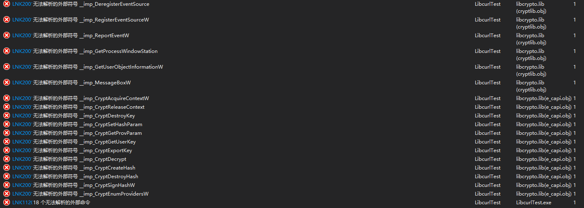
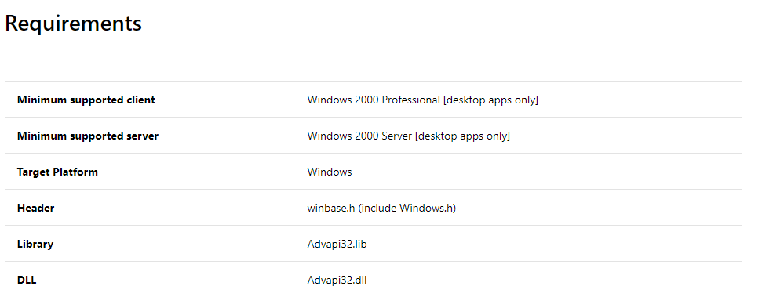

## libcurl源码编译记录
### Android a/so 编译
***
使用开源库： https://github.com/gcesarmza/curl-android-ios.git

1. 下载android ndk
2. 配置NDK_ROOT环境变量路径
3. 安装apt-get install autoconf
4. 安装apt-get install libtool

### Windows lib编译
***
libcurl如果需要使用SSL功能，需要提供编译好的SSL的库。因此，先编译OpenSSL。
#### 1 编译环境：

| 系统/软件          | 版本        | 下载地址                                                     |
| ------------------ | ----------- | ------------------------------------------------------------ |
| 操作系统           | Win10       |                                                              |
| Visual Studio 2015 | V14.0       |                                                              |
| OpenSSL            | -1.1.1-pre7 | [download](https://www.openssl.org/source/openssl-1.1.1-pre7.tar.gz) |
| perl               | v5.28.1     | [download](https://www.activestate.com/products/activeperl/downloads/thank-you/?dl=http://downloads.activestate.com/ActivePerl/releases) |
| libcurl            | curl-7.60.0 | [download](https://curl.haxx.se/download/curl-7.60.0.tar.gz) |
| nasm               | v2.13.01    | [download](http://www.nasm.us/pub/nasm/releasebuilds/2.13.01/win64/nasm-2.13.01-installer-x64.exe) |

备注：

* perl 安装之后在控制台输入perl -V查看版本信息，若正确输出则ok；

#### 2 编译OpenSSL

1. 首先编译32bit lib
2. 打开VS2015 x86本机工具命令行提示符，进入OpenSSL目录，然后输入perl Configure VC-WIN32 no-shared no-asm --prefix=D:\OpenSSL\x86
3. nmake
4. nmake install （拷贝编译库和头文件到目标目录）

备注：
* no-shared 表示编译静态库
* no-asm 不在编译过程中使用汇编代码加快编译过程
* VC-WIN32 表示32bit处理器，VC-WIN64A 针对ARM处理器，VC-WIN64I 针对Intel Itanium处理器

#### 3 编译Libcurl
用VS2015打开libcurl中projects/Windows/VC14的工程，Win32编译执行如下步骤：

1. 点击解决方案"libcurl"下面的libcurl展开，移除Resource Files下面的libcurl.rc
2. libcurl工程右键 -> 属性，在弹出的子窗口，确保配置选项为**所有配置**，平台为Win32，在左侧配置属性下面的常规选项下，将Widows SDK 版本更改为你的的Windows SDK版本，否则编译时会提示SDK不存在！
3. 点击左侧VC++目录，将编译出的openssl的include及lib目录分别添加到包含目录和库目录，完成后点击确定。
4. 切换到LIB Debug - LIB OpenSSL+Win32,右键点击右边的curl选择生成；
5. 切换到LIB Release - LIB OpenSSL+Win32,再次执行上一步的操作！

build文件在 curl-7.60.0\build\Win32\VC14 
* LIB Debug - LIB OpenSSL （和实际路径名称对应上即可）
* LIB Release - LIB OpenSSL

#### 4 测试编译的libcurl
创建项目，配置如下：

**所有配置**
* VC++包含目录包含刚刚libcurl下的include文件夹
*  C/C++预处理器加CURL_STATICLIB
*  连接器->输入->附加依赖项目加入
Crypt32.lib;
wldap32.lib;
ws2_32.lib;
libcrypto.lib;
libssl.lib 

备注：libcrypto.lib和libssl.lib需要从OpenSSL编译的时候拷过来，其余的是系统库。

**Debug**
* VC++目录 -> 库目录加入 D:\OpenSSL\lib;D:\libcurl\lib\LIB Debug - LIB OpenSSL
* 连接器下输入 -> 附加依赖项加入 libcurld.lib

**Release**
* VC++目录 -> 库目录加入 D:\OpenSSL\lib;D:\libcurl\lib\LIB Release - LIB
* OpenSSL;连接器下输入 -> 附加依赖项加入 libcurl.lib;

#### 5 测试代码

```C++
#include "include\curl\curl.h"

int main(int argc, char* argv[]) {
	CURL *curl = 0;
	CURLcode res;
	curl = curl_easy_init();
	if (curl != 0) {
		curl_easy_setopt(curl, CURLOPT_URL, "https://www.baidu.com");
		/* example.com is redirected, so we tell libcurl to follow redirection */
		curl_easy_setopt(curl, CURLOPT_SSL_VERIFYPEER, 0);
		/* Perform the request, res will get the return code */
		res = curl_easy_perform(curl);
		/* Check for errors */
		if (res != CURLE_OK) {
			fprintf(stderr, "curl_easy_perform() failed: %s\n", curl_easy_strerror(res));
		}
		/* always cleanup */
		curl_easy_cleanup(curl);
	}
	getchar();
	return 0;
}
```
运行若无报错，则编译成功！

#### 6 遇到的问题

6-1. 32bit lib测试成功，但是64bitlib在测试的时候报了如下错误：


记录一下解决问题的思路：看错误应该是依赖库没有链接上，首先看右侧报错文件为 cryptlib.obj，说明该文件中使用的需要依赖的库没有链接，于是进入OpenSSL源码中找到cryptlib.c这个源文件，搜索**DeregisterEventSource**这个关键字，确实有用到，然后google搜索该函数，发现是VC++的函数，所以需要链接一些系统库。这里附上[函数说明](https://docs.microsoft.com/en-us/windows/win32/api/winbase/nf-winbase-deregistereventsource)，进入该页面之后可以看到如下信息：


即该方法需要链接**Advapi32.lib**，因此在项目->属性->链接->输入中添加该链接库即可。同样的方式，可以fix其他链接库的问题。

#### 7 参考链接

[libcurl Windows编译参考链接](https://blog.jiangjiaolong.com/vs2017-libcurl-openssl.html)   （文中的dmake没有成功安装，暂时没发现有什么影响）

[OpenSSL编译参考1](https://zhuanlan.zhihu.com/p/31154924)

[OpenSSL编译参考2](https://www.cnblogs.com/hupeng1234/p/9721316.html)

[OpenSSL编译的configure说明](https://blog.51cto.com/nameyjj/511932)

